# SOL Scheduling

Patient booking application for SOL Mental Health, built by Awell.

## Purpose

This application is the entry point for patients seeking mental health services at SOL. It captures patient preferences, matches them with appropriate providers, and facilitates appointment booking. After booking, it hands off to Awell care flows for intake and ongoing engagement.

### User Journey

```mermaid
flowchart TD
    subgraph Onboarding["1️⃣ ONBOARDING"]
        A[Select State] --> B{Bordering State?}
        B -->|NJ or CT| C["Offer NY Services"]
        C -->|Yes, show me| D[Continue]
        B -->|Supported State| D
        D --> E[Select Service Type]
        E --> F[Enter Phone Number]
        F --> G[Enter Insurance]
        
        F -.->|Creates| SF1[(Salesforce Lead)]
        G -.->|Updates| SF1
    end

    subgraph Selection["2️⃣ PROVIDER SELECTION"]
        H[Browse Providers] --> I[View Provider Details]
        I --> J[Select a Time Slot]
    end

    subgraph Confirmation["3️⃣ CONFIRMATION"]
        K["Your appointment is selected"]
        K --> L[/"Complete your booking"/]
    end

    subgraph Behind["4️⃣ BEHIND THE SCENES"]
        M[Book Appointment] --> N[Start Intake Care Flow]
        N --> O[Stop Re-engagement Care Flow]
        O --> P[Update Salesforce & Healthie]
    end

    subgraph Patient["5️⃣ PATIENT RECEIVES"]
        Q[📧 Intake Forms]
        R[📅 Calendar Confirmation]
        S[✅ Ready for Session]
    end

    G --> H
    J --> K
    L --> M
    P --> Q
    Q --> R
    R --> S

    style N fill:#4ade80,stroke:#16a34a,color:#000
    style O fill:#f87171,stroke:#dc2626,color:#000
```



### Care Flows


| Care Flow | When Started | Purpose |
|-----------|--------------|---------|
| **Intake Care Flow** | Patient clicks "Complete your booking" | Sends intake forms, consent docs, and pre-appointment info |
| **Re-engagement Care Flow** | External trigger (Salesforce) | Reminds inactive patients to book. **Automatically stopped** when they book |

### Salesforce Integration

**Lead Lifecycle:**
- Lead created when phone number is entered (fire-and-forget)
- Lead updated with insurance during onboarding
- Lead updated with booking details on confirmation

### Analytics (PostHog)

- User identification linked to Salesforce Lead ID
- Event tracking: `lead_created`, `appointment_booked`, `waitlist_signup`
- API timing metrics for performance monitoring
- Feature flags control onboarding question configuration

## Quick Start

```bash
pnpm install
cp apps/scheduling-app/.env.example apps/scheduling-app/.env.local
# Configure SOL_API_KEY, SALESFORCE_*, POSTHOG_* credentials
pnpm dev:app
```

## Architecture

See [ARCHITECTURE.md](./ARCHITECTURE.md) for technical details including:
- Complete swimlane diagram of user flow and API calls
- External API integrations (SOL, Salesforce, PostHog)
- Data storage patterns
- Workflow implementation

## Deployment

- **App**: [sol-scheduling.vercel.app](https://sol-scheduling.vercel.app) — auto-deploys on merge to `main`
- **Package**: [@awell-health/sol-scheduling](https://www.npmjs.com/package/@awell-health/sol-scheduling) — reusable scheduling components

## Monorepo Structure

```
apps/scheduling-app/    # Next.js booking application (this project)
packages/scheduler/     # Reusable React scheduling components (npm package)
```

## Ownership

| Area | Notes |
|------|-------|
| Booking Application | Next.js app, Vercel hosting |
| Salesforce Integration | Lead create/update actions |
| Re-engagement Care Flow | Awell — recovers drop-offs via automated outreach; **stopped on booking** |
| Intake Care Flow | Awell — started on booking; qualifies patients, prepares for appointment |
| Analytics | PostHog — user tracking, feature flags, API metrics |
